# 🪐 Manga Downloader

<p align="center">
  
</p>

<p align="center">
  <a href="https://github.com/seaflower205/manga-downloader/blob/main/LICENSE"></a>
  <a href="https://developer.chrome.com/docs/extensions/mv3/intro/"></a>
  
</p>

---

**Manga Downloader** is a high-performance, developer-friendly browser extension (Chrome / Edge / Brave / Opera) built on **Manifest V3**. It dynamically extracts chapter images from any manga reader website, handles complex lazy-loading, and packages them into clean, organized ZIP files on the fly. 

It is completely customizable—configure any new website manually using CSS selectors or instantly via the integrated **AI-assisted DOM analysis engine**.

---

## 🏗️ System Architecture

The following diagram illustrates how the extension’s components (Background Service Worker, Content Scripts, and Popup UI) communicate and handle data extraction:

```mermaid
graph TD
    A[Manga Web Page] -->|Heuristic / AI DOM Capture| B[Content Script detector.js]
    B -->|Captured DOM / Pre-assigned Roles| C[Popup sites_manager.js]
    C -->|AI Prompt Copy| D[External AI Chatbot]
    D -->|Generated JSON Config| C
    C -->|Import Config| E[(chrome.storage.local)]
    F[Popup search_manager.js] -->|Search Query| G[Service Worker search_providers.js]
    G -->|Direct Fetch / Fallback DDG| A
    H[Popup UI / Content Panel] -->|Download Request| I[Content Script downloader.js]
    I -->|Auto-Scroll & Lazy-Load| A
    I -->|Fetch Images / Canvas Extract| J[Network fetch]
    J -->|JSZip Package| K[Download ZIP File]
    
    style E fill:#1e293b,stroke:#3b82f6,stroke-width:2px;
    style D fill:#1e1b4b,stroke:#818cf8,stroke-width:2px;
    style K fill:#064e3b,stroke:#10b981,stroke-width:2px;
```



---

## ⚠️ Disclaimer

> [!WARNING]
> This extension is a **general-purpose image extraction tool** designed for personal, offline archival use. Users are legally responsible for:
> - Complying with the Terms of Service of any websites accessed.
> - Ensuring they have the legal right or permission to download the content.
> - Not distributing or commercializing copyrighted content.
> 
> **This tool must NOT be used to:**
> - Bypass authorization/paywalls on paid or subscription-based platforms.
> - Circumvent digital rights management (DRM) protections.
> - Share or redistribute copyrighted materials.

---

## ✨ Features

### 🚀 Core Engine
- **Universal Image Grabber**: Configure any reader site with custom CSS selectors. Supports extraction from standard tags (``) or advanced canvas-based reader boards (`<canvas>`).
- **Zero-Delay ZIP Packager**: Leverages `JSZip` at the content script layer in `STORE` mode, packaging large chapters (>100 pages) in under 0.5 seconds without UI lockups.
- **Robust Lazy-Load Resolver**: Captures image sources from dynamically swapped attributes (e.g., `data-src`, `data-original`, `data-lazy-src`).
- **Dynamic Auto-Scroll**: Scrolls the page to trigger lazy-load scripts and cache canvas views before kicking off the download.
- **Smart Metadata Extraction**: Automatically parses manga titles, chapters, and volume details to name files neatly.

### 🧠 AI-Assisted Configuration
- **One-Click AI Prompts**: Generates a pre-formatted instructions prompt containing the structural page DOM. Simply paste it into ChatGPT, Gemini, or Claude, and copy-paste the resulting JSON config.
- **DOM Suggestion Engine**: Automatically labels target candidates in the DOM (e.g., `manga-title-candidate`, `manga-image-candidate`) to guide AI tools toward correct selectors.
- **Repetitive Node Collapse**: Shrinks large DOM trees down to 15-30KB by collapsing repeated lists (images, search grids), preventing LLM token overflows.

### 🔍 Unified Multi-Site Search
- **Simultaneous Scraping**: Search across all active configured websites in parallel.
- **DuckDuckGo Fallback Portals**: Automatically routing queries through static search engines when websites are guarded behind Cloudflare/WAF.
- **NSFW Isolation**: Supports dedicated tabs for Manga and adult/NSFW content, switching themes and layouts contextually.
- **Granular Provider Toggles**: Turn individual search providers on or off inside the search query settings.

### 🎨 Premium UI/UX & Themes
- **Glassmorphism Presets**: Pre-coded with 5 gorgeous themes (Cyberpunk, Sakura, Hacker, Ocean, Sunset) featuring micro-animations, blur effects, and glowing accents.
- **Brand SVG Customization**: Dynamically applies custom SVG icons on the header as theme presets change.
- **Layout Jitter Prevention**: Pre-renders placeholders and uses pulsing skeleton loaders (`previewPulse`) to maintain layout height stability while fetching download previews.
- **Floating Alerts**: Centered, non-intrusive notification bubbles with smooth entry slide-ins and fade-outs.

---

## 📦 Installation

1. **Clone the repository**:
   ```bash
   git clone https://github.com/seaflower205/manga-downloader.git
   ```
   *Alternatively, download the ZIP archive from GitHub and extract it locally.*

2. **Load the Unpacked Extension**:
   - Open Chrome or Microsoft Edge and navigate to `chrome://extensions/` (or `edge://extensions/`).
   - Enable **Developer mode** (toggle in the top-right corner).
   - Click the **Load unpacked** button (top-left).
   - Select the root project directory containing `manifest.json`.

3. **Pin to Toolbar**:
   - Click the extensions puzzle icon in your browser toolbar and pin **Manga Downloader**.

---

## 📖 Quick Start

### Method 1: AI-Assisted Site Configuration (Recommended)

1. Open any manga chapter page in your browser.
2. Click the **Manga Downloader** icon to open the popup.
3. Switch to the **Cấu Hình** (Configure) tab.
4. Enter the website name and the current chapter URL.
5. Click **Lấy Prompt AI** (Copy AI Prompt) to copy the prompt alongside the pre-processed DOM structure.
6. Paste this prompt into any AI chatbot (Gemini, ChatGPT, Claude).
7. Copy the JSON code block generated by the AI.
8. Paste it into the **Nhập Cấu Hình** (Import Configuration) box in the popup and click **Nhập**.
9. The site is now fully integrated for both downloads and unified search!

### Method 2: Manual Configuration

1. Inspect the reader page with DevTools (F12) to identify selectors:
   - **Image Selector**: e.g., `.chapter-content img` or `canvas`
   - **Title Selector**: e.g., `.breadcrumb-item.active` or `h1.title`
   - **Chapter Selector**: e.g., `.select-chapter option[selected]` or `.chapter-title`
2. Open the popup → **Cấu Hình** tab → Fill in the selector form → Click **Lưu**.

---

## 🗃️ Site Configuration Schema

Site profiles are saved locally using the following format:

```json
{
  "name": "Website Name",
  "domainPattern": "example\\.com",
  "chapterUrlPattern": "chapter|read",
  "imageSelector": ".reader-content img",
  "imageUrlAttribute": "src|data-src|data-original",
  "titleSelector": "h1.manga-title",
  "chapterSelector": ".chapter-info",
  "referer": "https://example.com/",
  "isNsfw": false,
  "searchSupported": true,
  "searchUrl": "https://example.com/search?q={query}",
  "searchResultSelector": ".search-result-item",
  "searchTitleSelector": ".result-title",
  "searchCoverSelector": ".result-cover img",
  "searchAuthorSelector": ".result-author"
}
```

---

## 📂 File Directory Structure

```
├── manifest.json           # Extension manifest (MV3)
├── background/
│   ├── background.js       # Service worker entry point
│   ├── network.js          # Network utilities (referer rewrite, cookies)
│   ├── search_providers.js # Search scraper and API lookup methods
│   ├── search_fallback.js  # Yahoo/DuckDuckGo search fallback scrapers
│   ├── utils.js            # Background service worker helper utilities
│   ├── offscreen.js        # Background canvas handling & DOM parsing
│   └── offscreen.html      # Offscreen template
├── content/
│   ├── content.js          # Main content script coordinator
│   ├── detector.js         # Heuristic DOM structure inspector
│   ├── downloader.js       # Image downloader & ZIP bundler
│   ├── ui.js               # Side-panel user interface & overlays
│   ├── grabber.js          # MAIN world injection script
│   └── iframe_bridge.js    # Cross-frame postMessage bridge
├── popup/
│   ├── popup.html          # Extension popup UI
│   ├── popup.js            # Popup controls coordinator
│   ├── popup.css           # Glassmorphism popup stylesheet
│   ├── search_manager.js   # Unified multi-site search panel manager
│   └── sites_manager.js    # Site config import/export, prompt builder
├── config/
│   └── sites.json          # Pre-packaged sites config database
├── icons/                  # Brand assets and graphics
└── utils/
    ├── security.js         # Input sanitization, URL check, diagnostics
    └── jszip.min.js        # JSZip library (MIT License)
```

---

## 🔒 Security & Privacy

- **No Remote Code Execution**: Rejects `eval()`, `new Function()`, and dynamic script injection. Built fully on Google-certified Manifest V3 standards.
- **DOM Sanitization**: Statically scrubs style, scripts, iframe, forms, and inline event listeners before capturing page structures.
- **Zero Tracker Policy**: Zero telemetries, trackers, or telemetry collection scripts. All logs and diagnostics are kept locally on your machine (`chrome.storage.local`).
- **Declarative Net Request Rules**: Dynamically modifies network referer headers with targeted, local rules that self-clean immediately after downloading finishes.

---

## 💻 Browser Compatibility

| Browser | Minimum Version | Required Manifest Support |
|---------|-----------------|---------------------------|
| **Google Chrome** | 90+ | Manifest V3 |
| **Microsoft Edge** | 90+ | Manifest V3 |
| **Brave** | 1.0+ | Manifest V3 |
| **Opera** | 76+ | Manifest V3 |

---

## 🤝 Contributing

1. Fork this repository.
2. Create your feature branch (`git checkout -b feature/your-feature`).
3. Commit your changes (`git commit -m 'Add your feature'`).
4. Push to your branch (`git push origin feature/your-feature`).
5. Open a Pull Request.

---

## 📄 License

This project is open-source and licensed under the **GNU General Public License v3.0** — see the [LICENSE](LICENSE) file for details.

### Third-Party Licenses
- **JSZip** v3.10.1 (MIT License) — see [THIRD_PARTY_LICENSES.md](THIRD_PARTY_LICENSES.md).

---

Developed with ❤️ by [seaflower205](https://github.com/seaflower205).
